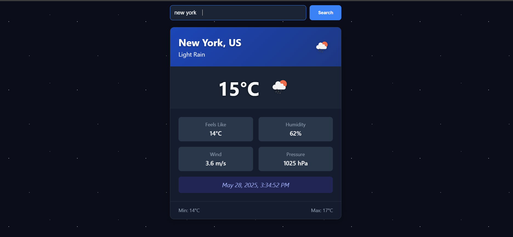
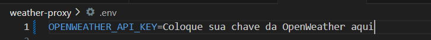

# 🌦️ Weather App - Previsão do Tempo em Tempo Real




Um aplicativo web de previsão do tempo que utiliza a API do OpenWeather, que oferece dados meteorológicos precisos e em tempo real, com um design moderno e interativo. Desenvolvido para ser rápido e intuitivo.

## 🌈Recursos do Aplicativo

**Busca por cidade**

**Exibição de:**

**Temperatura atual**

**Sensação térmica**

**Umidade**

**Velocidade do vento**

**Pressão atmosférica**


## 📌 Pré-requisitos

- Node.js 
- Angular 
- Conta no [OpenWeatherMap](https://openweathermap.org/) (para obter a API key)

## 🚀 Como Executar o Projeto

### 1. Configuração Inicial

Primeiro, clone o repositório:

```bash
git clone https://github.com/IamEduardok/Clima.git
cd weather-app

```
Configure o Weather-proxy

```bash
cd weather-proxy
```

No Arquivo ".env" 


Instale as dependências

```bash
Npm install
```

Para configurar o Angular

```bash
Cd Weather-app
npm install
Ng S
```

## 🛠️ Tecnologias Utilizadas

- [VS CODE](https://code.visualstudio.com/) | Ambiente de desenvolvimento integrado para escrever, ler e executar código do projeto com mais eficiência.
- [Git Bash](https://git-scm.com/downloads) | GitBash para realizar os commits.
- [Angular](https://angular.io/start) | Plataforma de aplicações Web.
- [OpenWeatherMap API](https://openweathermap.org/api) | Para a API Key.


## 📜 Licença
Este projeto é licenciado sob os termos do arquivo [LICENÇA](LICENSE). Veja o arquivo para mais detalhes. <br>

